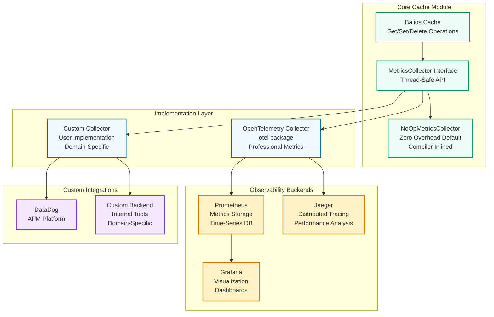

# Balios: High-Performance Caching Library for Go


Balios is a high-performance in-memory caching library for Go, based on W-TinyLFU, engineered for maximum throughput, optimal hit ratio, professional security & advanced observability—without sacrificing developer experience.

[](https://github.com/agilira/balios/actions/workflows/ci.yml)
[](https://github.com/agilira/balios/actions/workflows/codeql.yml)
[](https://github.com/agilira/balios/actions/workflows/ci.yml)
[](https://goreportcard.com/report/github.com/agilira/balios)
[](https://github.com/agilira/balios)
[](https://www.bestpractices.dev/projects/11297)

**[Features](#features) • [Quick Start](#quick-start) • [Performance](#performance) • [Observability Architecture](#observability-architecture) • [Philosophy](#the-philosophy-behind-balios) • [Documentation](#documentation)**

## Features

- **Type-Safe Generics API**: `GenericCache[K comparable, V any]` with compile-time type safety
- **Automatic Loading**: `GetOrLoad()` API with singleflight pattern for cache stampede prevention
- **W-TinyLFU Algorithm**: Combines frequency and recency for optimal eviction decisions
- **Lock-Free**: Uses atomic primitives for high concurrency
- **TTL Support**: Hybrid expiration strategy with inline opportunistic cleanup + manual `ExpireNow()` API (v1.1.32+)
- **Context Support**: Timeout and cancellation for loader functions
- **Negative Caching**: Cache loader errors to prevent repeated failed operations (v1.1.2+)
- **Structured Errors**: Rich error context with [go-errors](https://github.com/agilira/go-errors) - see [examples/errors/](examples/errors/)
- **Observability**: OpenTelemetry integration for metrics (p50/p95/p99 latencies, hit ratio) & logger interface. Zero overhead when disabled (compiler eliminates no-op implementations) - see [examples/otel-prometheus/](examples/otel-prometheus/)
- **Secure by Design**: [Red-team tested](balios_security_test.go) and [fuzz tested](balios_fuzz_test.go) against a wide range of attacks

## Compatibility and Support

Balios is designed for Go 1.24+ environments and follows Long-Term Support guidelines to ensure consistent performance across production deployments.

## Installation

```bash
go get github.com/agilira/balios
```

## Quick Start

### Type-Safe Generic API

```go
package main

import (
    "fmt"
    "time"
    
    "github.com/agilira/balios"
)

type User struct {
    ID   int
    Name string
    Role string
}

func main() {
    // Create type-safe cache
    cache := balios.NewGenericCache[string, User](balios.Config{
        MaxSize: 10_000,
        TTL:     time.Hour,
    })
    
    // Set a value
    cache.Set("user:123", User{
        ID:   123,
        Name: "John Doe",
        Role: "admin",
    })
    
    // Get a value (no type assertion needed)
    if user, found := cache.Get("user:123"); found {
        fmt.Printf("User: %s (%s)\n", user.Name, user.Role)
    }
    
    // Check stats
    stats := cache.Stats()
    fmt.Printf("Hit ratio: %.2f%%\n", stats.HitRatio()*100)
}
```
## Performance

**Single-Threaded Performance:**

| Package | Set (ns/op) | Set % vs Balios | Get (ns/op) | Get % vs Balios | Allocations |
| :------ | ----------: | --------------: | ----------: | --------------: | ----------: |
| **Balios** | **194.4 ns/op** | **+0%** | **110.8 ns/op** | **+0%** | **2/0 allocs/op** |
| Balios-Generic | 198.2 ns/op | +2% | 115.0 ns/op | +4% | 2/0 allocs/op |
| Otter | 365.3 ns/op | +88% | 121.2 ns/op | +9% | 1/0 allocs/op |
| Ristretto | 280.0 ns/op | +44% | 156.7 ns/op | +41% | 2/0 allocs/op |

**Parallel Performance (8 cores):**

| Package | Set (ns/op) | Set % vs Balios | Get (ns/op) | Get % vs Balios | Allocations |
| :------ | ----------: | --------------: | ----------: | --------------: | ----------: |
| **Balios** | **59.26 ns/op** | **+0%** | **25.50 ns/op** | **+0%** | **2/0 allocs/op** |
| Balios-Generic | 60.84 ns/op | +3% | 27.33 ns/op | +7% | 2/0 allocs/op |
| Otter | 240.1 ns/op | +305% | 25.78 ns/op | +1% | 1/0 allocs/op |
| Ristretto | 115.1 ns/op | +94% | 30.04 ns/op | +18% | 1/0 allocs/op |

**Mixed Workloads (Realistic Scenarios):**

| Workload | Balios | Balios-Generic | Otter | Ristretto | Best |
| :------- | -----: | -------------: | ----: | --------: | :--- |
| Write-Heavy (10% R / 90% W) | **85.82 ns/op** | 100.7 ns/op | 210.3 ns/op | 125.4 ns/op | **Balios** |
| Balanced (50% R / 50% W) | **50.01 ns/op** | 52.81 ns/op | 132.5 ns/op | 113.2 ns/op | **Balios** |
| Read-Heavy (90% R / 10% W) | **35.08 ns/op** | 36.84 ns/op | 47.64 ns/op | 70.81 ns/op | **Balios** |
| Read-Only (100% R) | **36.59 ns/op** | 55.91 ns/op | 46.95 ns/op | 31.63 ns/op | **Ristretto** |

**Hit Ratio (100K requests, Zipf distribution):**

| Cache | Hit Ratio | Notes |
| :---- | --------: | :---- |
| **Balios** | 79.86% | Excellent |
| Balios-Generic | 79.71% | Excellent |
| **Otter** | 79.53% | Excellent |
| Ristretto | 71.19% | Good |

**Test Environment:** AMD Ryzen 5 7520U, Go 1.25+

Run the benchmarks on your hardware [benchmarks/](benchmarks/) to evaluate performance on your specific workload and configuration. 
See [docs/PERFORMANCE.md](docs/PERFORMANCE.md) for detailed analysis and methodology.

### Advanced Configuration

**Negative Caching** (v1.1.2+): Cache loader errors to prevent repeated failed operations

```go
cache := balios.NewGenericCache[int, User](balios.Config{
    MaxSize:          10_000,
    TTL:              5 * time.Minute,
    NegativeCacheTTL: 30 * time.Second, // Cache errors for 30s
})

// First call: loader fails
_, err := cache.GetOrLoad(123, func() (User, error) {
    return User{}, fmt.Errorf("database unavailable")
})
// Error returned

// Subsequent calls within 30s: cached error returned WITHOUT calling loader
_, err = cache.GetOrLoad(123, func() (User, error) {
    panic("This won't be called - error is cached!")
})
// Same error returned (no loader execution)
```

**Use cases**: Circuit breaker pattern, API rate limiting, external service failures.  
**See**: [GetOrLoad documentation](docs/GETORLOAD.md#negative-caching-v112) for complete guide.

### Automatic Loading with GetOrLoad

Prevent cache stampede with singleflight pattern:

```go
// Multiple concurrent requests for same key = single loader execution
user, err := cache.GetOrLoad("user:123", func() (User, error) {
    // This expensive operation runs only once
    return fetchUserFromDB(123)
})
if err != nil {
    log.Printf("Failed to load user: %v", err)
    return
}
```

With context support for timeout/cancellation:

```go
ctx, cancel := context.WithTimeout(context.Background(), 5*time.Second)
defer cancel()

user, err := cache.GetOrLoadWithContext(ctx, "user:123", 
    func(ctx context.Context) (User, error) {
        return fetchUserFromDBWithContext(ctx, 123)
    })
```

**Key characteristics:**
- Cache hit: Same performance as `Get()` operations (27.90 ns/op parallel, 0 allocations)
- Concurrent requests: 1000 simultaneous requests = 1 loader call (singleflight)
- Error handling: Loader errors can be cached with `NegativeCacheTTL` option
- Panic recovery: Returns `BALIOS_PANIC_RECOVERED` error if loader panics

See [examples/getorload/](examples/getorload/) for comprehensive examples.

## Observability Architecture



### Logger Interface

```go
// Logger defines a minimal logging interface with zero overhead.
// Implementations should use structured logging and be allocation-free.
type Logger interface {
    // Debug logs a debug message with optional key-value pairs.
    Debug(msg string, keyvals ...interface{})

    // Info logs an info message with optional key-value pairs.
    Info(msg string, keyvals ...interface{})

    // Warn logs a warning message with optional key-value pairs.
    Warn(msg string, keyvals ...interface{})

    // Error logs an error message with optional key-value pairs.
    Error(msg string, keyvals ...interface{})
}
```

**Integration example:**
```go
import "log/slog"

// Using standard library slog
logger := slog.New(slog.NewJSONHandler(os.Stdout, nil))

cache := balios.New[string, User](balios.Config{
    Size: 1000,
    Logger: logger,
})
```

see [Metrics & Observability](docs/METRICS.md) for full documentation.

## The Philosophy Behind Balios

Balios and his brother Xanthos were the immortal horses of Achilles, born from Zephyros, the swiftest of the Anemoi. They were not merely fast—they were the children of the wind itself, incomparable to mortal steeds. Balios possessed intelligence beyond any horse, an instinct that guided Achilles through every battle with perfect judgment.

When Patroclus fell, it was Xanthos who spoke—granted voice by Hera herself—to warn Achilles of his fate. But Balios remained silent, his wisdom expressed not in words but in action, in knowing when to charge and when to wheel away, in the perfect synchrony between horse and hero that transcends command.

## Documentation

- [Architecture](docs/ARCHITECTURE.md) - W-TinyLFU internals, lock-free design, memory layout
- [Performance](docs/PERFORMANCE.md) - Comprehensive benchmarks, hit ratio analysis, scalability
- [GetOrLoad API](docs/GETORLOAD.md) - Cache stampede prevention, singleflight pattern, best practices
- [Metrics & Observability](docs/METRICS.md) - OpenTelemetry integration, Prometheus queries, monitoring best practices
- [Error Handling](docs/ERRORS.md) - Structured error codes and contexts
findings, and production safety guarantees
- [Examples](examples/) - Comprehensive usage examples
- [Benchmarks](benchmarks/) - Performance comparison with popular libraries
- [otel/README.md](otel/README.md) and [examples/otel-prometheus/](examples/otel-prometheus/) for complete setup with Grafana dashboard.

## Future Enhancements (PLANNED)
- Async refresh (stale-while-revalidate pattern)
- Persistence (save/load from disk)
- Distributed cache coordination
- Write-through/write-behind patterns

## License

Balios is licensed under the [Mozilla Public License 2.0](./LICENSE.md).

---

Balios • an AGILira fragment
