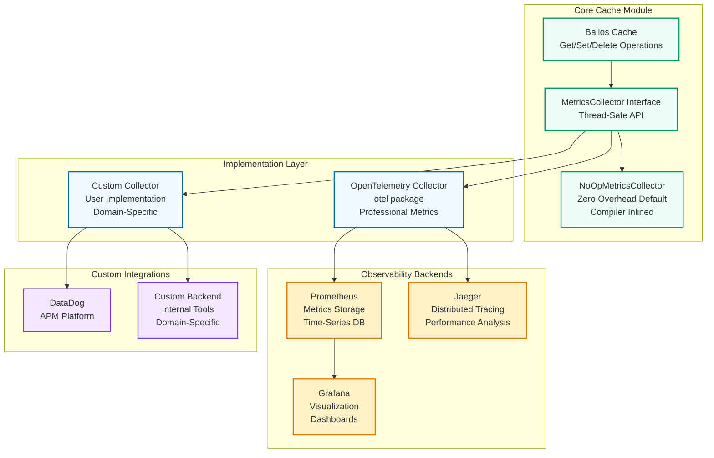

# Metrics and Observability

This guide explains how to monitor balios cache performance using the MetricsCollector interface and OpenTelemetry integration.

## Table of Contents

- [Overview](#overview)
- [Architecture](#architecture)
- [MetricsCollector Interface](#metricscollector-interface)
- [OpenTelemetry Integration](#opentelemetry-integration)
- [Metrics Reference](#metrics-reference)
- [Monitoring Examples](#monitoring-examples)
- [Best Practices](#best-practices)
- [Custom Collectors](#custom-collectors)

## Overview

Balios provides enterprise-grade observability through a clean separation of concerns:

1. **Core Module** (`github.com/agilira/balios`): Defines the `MetricsCollector` interface
2. **OTEL Package** (`github.com/agilira/balios/otel`): Implements OpenTelemetry integration
3. **Your Application**: Chooses which monitoring solution to use (OTEL, custom, or none)

This architecture keeps the core lightweight while enabling professional monitoring when needed.

## Architecture



## MetricsCollector Interface

The `MetricsCollector` interface is defined in the core module:

```go
// MetricsCollector defines the interface for collecting cache metrics.
type MetricsCollector interface {
    // RecordGet records a Get operation.
    // latencyNs: Operation latency in nanoseconds
    // hit: Whether the operation was a cache hit (true) or miss (false)
    RecordGet(latencyNs int64, hit bool)

    // RecordSet records a Set operation.
    // latencyNs: Operation latency in nanoseconds
    RecordSet(latencyNs int64)

    // RecordDelete records a Delete operation.
    // latencyNs: Operation latency in nanoseconds
    RecordDelete(latencyNs int64)

    // RecordEviction records an eviction event.
    RecordEviction()
}
```

### Implementation Requirements

Any implementation must be:

1. **Thread-Safe**: Safe for concurrent use by multiple goroutines
2. **Low Overhead**: <100ns per operation (allocation-free preferred)
3. **Non-Blocking**: Should not block cache operations
4. **Lock-Free**: Use atomic operations or lock-free data structures

### NoOpMetricsCollector

The default implementation does nothing and has zero overhead:

```go
// NoOpMetricsCollector is a no-op implementation.
// All methods are empty and inlined by the compiler (zero overhead).
type NoOpMetricsCollector struct{}

func (NoOpMetricsCollector) RecordGet(latencyNs int64, hit bool) {}
func (NoOpMetricsCollector) RecordSet(latencyNs int64)          {}
func (NoOpMetricsCollector) RecordDelete(latencyNs int64)       {}
func (NoOpMetricsCollector) RecordEviction()                    {}
```

The compiler inlines these empty methods, resulting in **zero overhead** when metrics collection is not used.

## OpenTelemetry Integration

The `balios/otel` package provides professional OpenTelemetry integration.

### Installation

```bash
go get github.com/agilira/balios/otel
```

### Basic Setup

```go
import (
    "github.com/agilira/balios"
    baliosostel "github.com/agilira/balios/otel"
    "go.opentelemetry.io/otel/exporters/prometheus"
    "go.opentelemetry.io/otel/sdk/metric"
)

// Setup Prometheus exporter
exporter, err := prometheus.New()
if err != nil {
    log.Fatal(err)
}

// Create OTEL MeterProvider
provider := metric.NewMeterProvider(metric.WithReader(exporter))
defer provider.Shutdown(context.Background())

// Create metrics collector
metricsCollector, err := baliosostel.NewOTelMetricsCollector(provider)
if err != nil {
    log.Fatal(err)
}

// Configure cache with metrics
cache := balios.NewGenericCache[string, User](balios.Config{
    MaxSize:          10_000,
    MetricsCollector: metricsCollector,
})
```

### Custom Meter Name

Useful for distinguishing multiple cache instances:

```go
collector, err := baliosostel.NewOTelMetricsCollector(
    provider,
    baliosostel.WithMeterName("myapp_user_cache"),
)
```

### Custom Histogram Buckets

Configure buckets for better percentile accuracy:

```go
provider := metric.NewMeterProvider(
    metric.WithReader(exporter),
    metric.WithView(metric.NewView(
        metric.Instrument{Name: "balios_get_latency_ns"},
        metric.Stream{
            Aggregation: metric.AggregationExplicitBucketHistogram{
                // Buckets in nanoseconds: 100ns, 500ns, 1μs, 5μs, 10μs, 50μs, 100μs
                Boundaries: []float64{100, 500, 1000, 5000, 10000, 50000, 100000},
            },
        },
    )),
)
```

## Metrics Reference

### Histograms

Histograms automatically calculate percentiles (p50, p95, p99, p99.9).

#### `balios_get_latency_ns`

**Type**: Int64Histogram  
**Unit**: Nanoseconds  
**Description**: Latency of Get() operations

**Typical Values**:
- p50: 100-200ns (cache hit)
- p95: 500-1000ns
- p99: 1-5μs
- p99.9: 5-50μs

**High Values Indicate**:
- Lock contention (many concurrent writers)
- Memory pressure (GC pauses)
- Large cache size (slower lookups in TinyLFU sketch)

#### `balios_set_latency_ns`

**Type**: Int64Histogram  
**Unit**: Nanoseconds  
**Description**: Latency of Set() operations

**Typical Values**:
- p50: 100-300ns
- p95: 500-2000ns
- p99: 2-10μs

**High Values Indicate**:
- Frequent evictions (cache too small)
- Many concurrent writes (lock contention)
- Memory allocation overhead

#### `balios_delete_latency_ns`

**Type**: Int64Histogram  
**Unit**: Nanoseconds  
**Description**: Latency of Delete() operations

**Typical Values**:
- p50: 50-150ns
- p95: 200-500ns
- p99: 500ns-2μs

**High Values Indicate**:
- Lock contention
- Large number of segments to search

### Counters

Counters are monotonically increasing values.

#### `balios_get_hits_total`

**Type**: Int64Counter  
**Description**: Total number of cache hits

Use with `rate()` to get hits per second:
```promql
rate(balios_get_hits_total[1m])
```

#### `balios_get_misses_total`

**Type**: Int64Counter  
**Description**: Total number of cache misses

Use with `rate()` to get misses per second:
```promql
rate(balios_get_misses_total[1m])
```

#### `balios_evictions_total`

**Type**: Int64Counter  
**Description**: Total number of evictions

**High Eviction Rate Indicates**:
- Cache size too small for workload
- Poor key distribution (hot keys causing frequent evictions)
- TTL too aggressive

## Monitoring Examples

### Prometheus Queries

#### Hit Ratio (Last 5 Minutes)

```promql
rate(balios_get_hits_total[5m]) / 
(rate(balios_get_hits_total[5m]) + rate(balios_get_misses_total[5m]))
```

**Target**: >80% for most workloads

#### P95 Get Latency

```promql
histogram_quantile(0.95, rate(balios_get_latency_ns_bucket[5m]))
```

**Target**: <1000ns (1μs) for production caches

#### P99 Get Latency

```promql
histogram_quantile(0.99, rate(balios_get_latency_ns_bucket[5m]))
```

**Target**: <5000ns (5μs)

#### Operations per Second

```promql
rate(balios_get_hits_total[1m]) + rate(balios_get_misses_total[1m])
```

#### Evictions per Minute

```promql
rate(balios_evictions_total[1m]) * 60
```

**Target**: <10% of cache size per minute

#### Average Latency

```promql
rate(balios_get_latency_ns_sum[5m]) / rate(balios_get_latency_ns_count[5m])
```

### Grafana Alerts

#### Low Hit Ratio Alert

```yaml
- alert: LowCacheHitRatio
  expr: |
    rate(balios_get_hits_total[5m]) / 
    (rate(balios_get_hits_total[5m]) + rate(balios_get_misses_total[5m])) < 0.8
  for: 5m
  labels:
    severity: warning
  annotations:
    summary: "Cache hit ratio below 80%"
    description: "Hit ratio is {{ $value | humanizePercentage }}"
```

#### High Latency Alert

```yaml
- alert: HighCacheLatency
  expr: |
    histogram_quantile(0.99, rate(balios_get_latency_ns_bucket[5m])) > 10000
  for: 5m
  labels:
    severity: warning
  annotations:
    summary: "P99 cache latency above 10μs"
    description: "P99 latency is {{ $value }}ns"
```

#### High Eviction Rate Alert

```yaml
- alert: HighEvictionRate
  expr: rate(balios_evictions_total[1m]) > 100
  for: 5m
  labels:
    severity: warning
  annotations:
    summary: "High cache eviction rate"
    description: "Eviction rate is {{ $value }} evictions/sec"
```

## Best Practices

### 1. Always Monitor Hit Ratio

Hit ratio is the most important cache metric. Target >80% for most workloads.

**Low Hit Ratio (<70%) Indicates**:
- Cache too small
- Poor key distribution
- Wrong eviction policy for workload
- TTL too aggressive

### 2. Set Latency SLOs

Define Service Level Objectives for latency:

- **p50**: <200ns (median user experience)
- **p95**: <1μs (95% of requests)
- **p99**: <5μs (tail latency)
- **p99.9**: <50μs (worst case acceptable)

### 3. Monitor Eviction Rate

**Healthy Eviction Rate**: <10% of cache size per minute

**High Eviction Rate** indicates cache is too small. Consider:
- Increasing `MaxSize`
- Adjusting TTL
- Analyzing key distribution

### 4. Correlate Metrics

Always correlate multiple metrics:

- **High latency + High eviction rate** = Cache too small
- **High latency + Low eviction rate** = Lock contention or GC pressure
- **Low hit ratio + Low eviction rate** = Poor key distribution or cold cache

### 5. Use Custom Histogram Buckets

Default buckets may not match your latency profile. Customize:

```go
// For sub-microsecond caches (very fast)
Boundaries: []float64{50, 100, 200, 500, 1000, 2000, 5000}

// For microsecond-range caches (typical)
Boundaries: []float64{100, 500, 1000, 5000, 10000, 50000, 100000}

// For slow caches with network calls
Boundaries: []float64{1000, 5000, 10000, 50000, 100000, 500000, 1000000}
```

### 6. Reuse MeterProvider

Create one MeterProvider per application:

```go
// At application startup
provider := metric.NewMeterProvider(metric.WithReader(exporter))
defer provider.Shutdown(context.Background())

// Reuse for all caches
collector1, _ := baliosostel.NewOTelMetricsCollector(provider)
collector2, _ := baliosostel.NewOTelMetricsCollector(provider, 
    baliosostel.WithMeterName("cache2"))
```

### 7. Graceful Shutdown

Always shutdown MeterProvider on exit:

```go
defer func() {
    ctx, cancel := context.WithTimeout(context.Background(), 5*time.Second)
    defer cancel()
    if err := provider.Shutdown(ctx); err != nil {
        log.Printf("Failed to shutdown meter provider: %v", err)
    }
}()
```

### 8. Test Metrics in CI/CD

Include metrics in your tests:

```go
func TestCacheWithMetrics(t *testing.T) {
    reader := metric.NewManualReader()
    provider := metric.NewMeterProvider(metric.WithReader(reader))
    defer provider.Shutdown(context.Background())

    collector, _ := baliosostel.NewOTelMetricsCollector(provider)
    cache := balios.NewGenericCache[string, string](balios.Config{
        MaxSize:          100,
        MetricsCollector: collector,
    })

    // Perform operations
    cache.Set("key", "value")
    cache.Get("key")

    // Collect and verify metrics
    var rm metricdata.ResourceMetrics
    if err := reader.Collect(context.Background(), &rm); err != nil {
        t.Fatal(err)
    }
    
    // Assert metrics were recorded
    // ... verify histogram data points, counters, etc.
}
```

## Custom Collectors

You can implement your own `MetricsCollector` for custom backends.

### Example: StatsD Collector

```go
import "github.com/DataDog/datadog-go/statsd"

type StatsDMetricsCollector struct {
    client *statsd.Client
}

func NewStatsDMetricsCollector(addr string) (*StatsDMetricsCollector, error) {
    client, err := statsd.New(addr)
    if err != nil {
        return nil, err
    }
    return &StatsDMetricsCollector{client: client}, nil
}

func (c *StatsDMetricsCollector) RecordGet(latencyNs int64, hit bool) {
    c.client.Histogram("balios.get.latency", float64(latencyNs), nil, 1)
    if hit {
        c.client.Incr("balios.get.hits", nil, 1)
    } else {
        c.client.Incr("balios.get.misses", nil, 1)
    }
}

func (c *StatsDMetricsCollector) RecordSet(latencyNs int64) {
    c.client.Histogram("balios.set.latency", float64(latencyNs), nil, 1)
}

func (c *StatsDMetricsCollector) RecordDelete(latencyNs int64) {
    c.client.Histogram("balios.delete.latency", float64(latencyNs), nil, 1)
}

func (c *StatsDMetricsCollector) RecordEviction() {
    c.client.Incr("balios.evictions", nil, 1)
}
```

### Example: Atomic Counters (Internal Stats)

```go
import "sync/atomic"

type AtomicMetricsCollector struct {
    getCount    atomic.Uint64
    hitCount    atomic.Uint64
    missCount   atomic.Uint64
    setCount    atomic.Uint64
    deleteCount atomic.Uint64
    evictions   atomic.Uint64
}

func (c *AtomicMetricsCollector) RecordGet(latencyNs int64, hit bool) {
    c.getCount.Add(1)
    if hit {
        c.hitCount.Add(1)
    } else {
        c.missCount.Add(1)
    }
}

func (c *AtomicMetricsCollector) RecordSet(latencyNs int64) {
    c.setCount.Add(1)
}

func (c *AtomicMetricsCollector) RecordDelete(latencyNs int64) {
    c.deleteCount.Add(1)
}

func (c *AtomicMetricsCollector) RecordEviction() {
    c.evictions.Add(1)
}

func (c *AtomicMetricsCollector) HitRatio() float64 {
    hits := c.hitCount.Load()
    total := c.getCount.Load()
    if total == 0 {
        return 0
    }
    return float64(hits) / float64(total)
}
```

## Performance Considerations

### Overhead Comparison

| Implementation | Overhead | Notes |
|----------------|----------|-------|
| NoOpMetricsCollector | 0% | Inlined by compiler |
| OTelMetricsCollector | ~5% | Lock-free OTEL instruments |
| Custom Atomic | ~2-3% | Lock-free atomic operations |
| Custom with Mutex | ~10-20% | Lock contention possible |
| Network-based (StatsD) | ~50-100% | Network I/O overhead |

### Recommendations

1. **Production**: Use OTelMetricsCollector (~5% overhead acceptable)
2. **Low-latency services**: Use NoOp or custom atomic collector
3. **Testing**: Use custom atomic collector for in-process stats
4. **Development**: Any collector (overhead not critical)

### Minimizing Overhead

1. **Avoid locks**: Use atomic operations or lock-free data structures
2. **Batch operations**: Aggregate metrics before sending (network-based collectors)
3. **Async processing**: Use channels to offload work from hot path
4. **Sampling**: Record 1 in N operations for very high-throughput caches

Example with sampling:

```go
type SamplingCollector struct {
    inner    balios.MetricsCollector
    counter  atomic.Uint64
    sampleN  uint64 // Sample 1 in N operations
}

func (c *SamplingCollector) RecordGet(latencyNs int64, hit bool) {
    if c.counter.Add(1)%c.sampleN == 0 {
        c.inner.RecordGet(latencyNs, hit)
    }
}
```

## Related

- [otel/README.md](../otel/README.md) - OpenTelemetry package documentation
- [examples/otel-prometheus/](../examples/otel-prometheus/) - Complete example with Grafana
- [ARCHITECTURE.md](ARCHITECTURE.md) - W-TinyLFU internals
- [PERFORMANCE.md](PERFORMANCE.md) - Benchmark results

## Summary

Balios provides professional observability through:

**Clean Interface**: `MetricsCollector` interface in core  
**Zero Overhead Default**: NoOp implementation when not needed  
**OTEL Integration**: Separate package for enterprise monitoring  
**Extensible**: Easy to implement custom collectors  
**Production Ready**: <5% overhead with OTelMetricsCollector  

Choose the monitoring solution that fits your needs:
- **No monitoring**: Default NoOp (zero overhead)
- **OpenTelemetry**: Use `balios/otel` package (industry standard)
- **Custom**: Implement MetricsCollector interface

---

Balios • an AGILira fragment